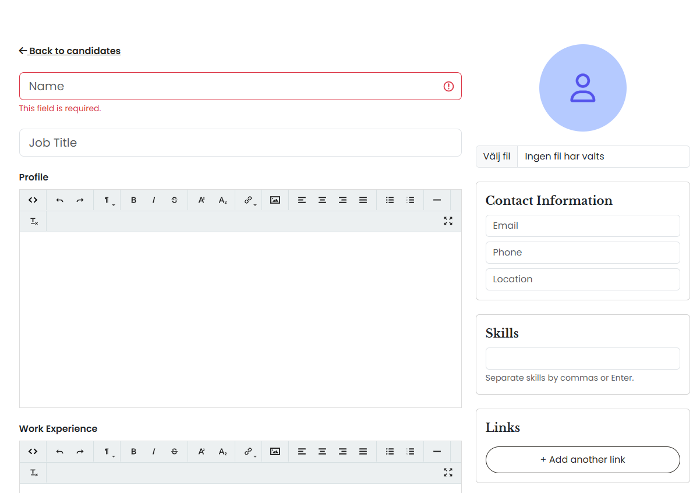
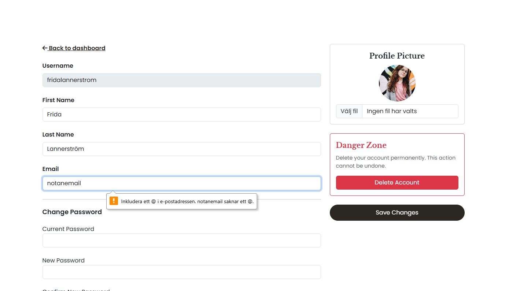
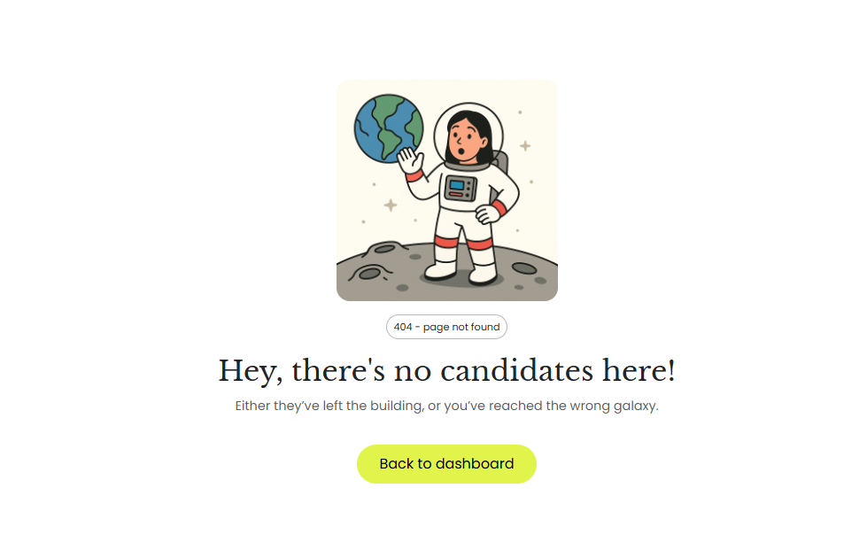
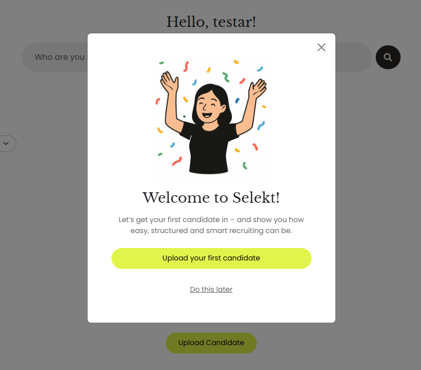
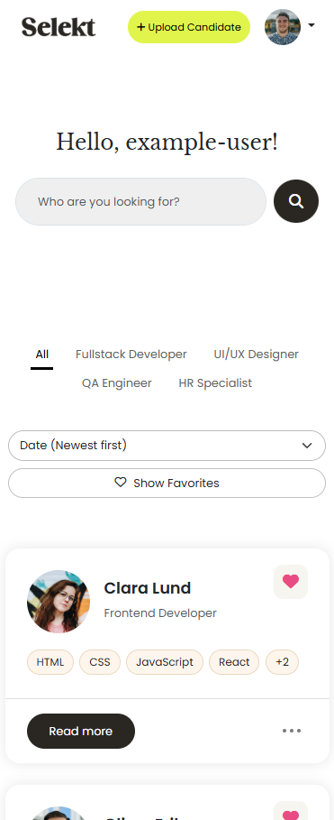
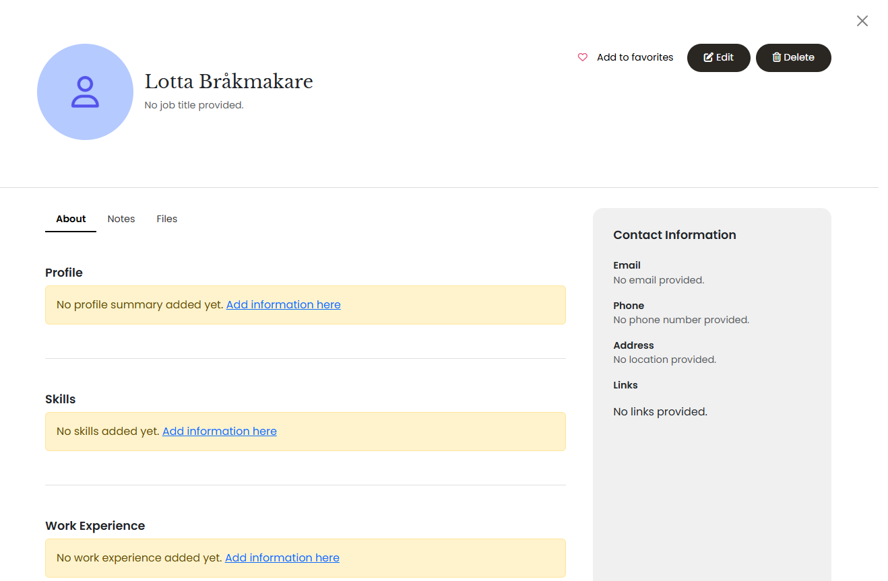
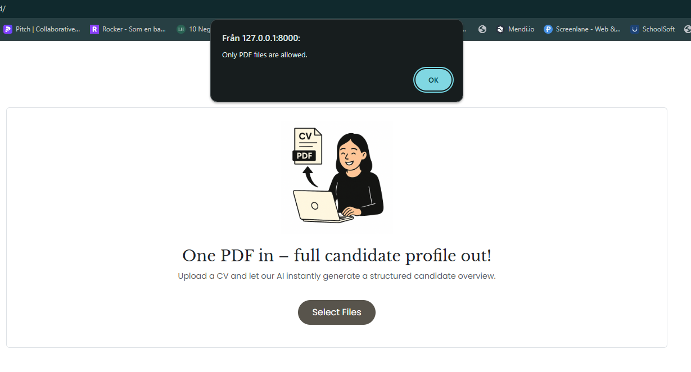
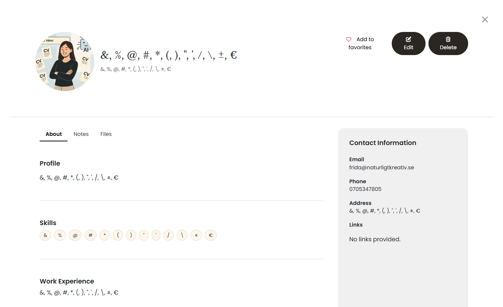

Selekt is a web application created to help recruiters and HR professionals manage candidates more efficiently.

Built as part of my Full-Stack Software Development course, this project allowed me to combine my passion for psychology, recruitment, and technology into a practical, real-world platform.

The goal of the application is to provide users with an intuitive and accessible system where they can register, log in, add and manage candidates, and store important information such as CVs, test results, and interview notes. I wanted the system to be simple yet powerful, making it easier to organize, compare, and assess candidates during a recruitment process.

Selekt is designed with a clean and professional interface, focusing on usability, responsiveness, and a user-friendly experience.


# Table of Contents

1. [User Experience (UX)](#user-experience-ux)
    - [Goals](#goals)
    - [User Stories](#user-stories)
    - [Wireframes](#wireframes)
    - [Graphic Design & Color Scheme](#graphic-design--color-scheme)
    - [UI/UX Design](#uiux-design)
2. [Agile Methodology](#agile-methodology)
3. [Project Overview](#project-overview)
    - [Introduction](#introduction)
    - [Workflows](#workflows)
    - [Database Overview](#database-overview)
    - [Project Goals](#project-goals)
    - [Project Structure](#project-structure)
4. [Features](#features)
    - [Page Elements](#page-elements)
    - [Key Features](#key-features)
    - [Additional Features](#additional-features)
    - [Feature Changes](#feature-changes)
    - [Future Features](#future-features)
5. [Tools and Technologies](#tools-and-technologies)
    - [Languages](#languages)
    - [Libraries](#libraries)
    - [Development Tools](#development-tools)
    - [Other Tools](#other-tools)
6. [Testing](#testing)
    - [Code Validation](#code-validation)
    - [Browser Compatibility](#browser-compatibility)
    - [Responsiveness](#responsiveness)
    - [User Story Testing](#user-story-testing)
    - [Manual Feature Testing](#manual-feature-testing)
    - [Known Bugs](#known-bugs)
    - [Unfixed Bugs](#unfixed-bugs)
7. [Deployment](#deployment)
    - [Local Deployment](#local-deployment)
    - [GitHub Repository](#github-repository)
    - [Heroku Deployment](#heroku-deployment)
8. [Credits](#credits)
    - [Content & Media](#content--media)
    - [Other Credits](#other-credits)
    - [Acknowledgements](#acknowledgements)


---

## User Experience (UX)

This section covers the user-centered design process of the project. It includes the project goals, user stories, wireframes, and the overall visual and interactive design decisions.

- **Goals:** Outlines the main goals for both external users and the site owner.
- **User Stories:** Lists the user stories collected during the planning phase, prioritized by must-have, should-have, could-have categories.
- **Wireframes:** Displays initial wireframes or mockups that guided the project layout and structure.
- **Graphic Design & Color Scheme:** Describes the color palette, typography, and graphical elements used.
- **UI/UX Design:** Explains how the user interface and experience were designed with usability, accessibility, and intuitive navigation in mind.

---

## Agile Methodology

This project followed an Agile approach throughout the development process. GitHub Projects was used to manage and track progress with Epics, User Stories, and Tasks. User Stories were categorized and prioritized using the MoSCoW method (Must-have, Should-have, Could-have, Won't-have). Screenshots and examples of the project board are provided to show how the project evolved over time.

---

## Project Overview

This section gives a broad overview of the project and technical structure, specifically tailored for a Django-based web application.

- **Introduction:** A brief explanation of the project purpose and its intended audience.
- **Workflows:** Describes the user workflows and how users interact with the system (e.g., register, log in, add candidates).
- **Database Overview:** Summarizes the Django data models and relationships used in the application.
- **Project Goals:** Details the business logic and goals the application is designed to meet.
- **Project Structure:** Outlines the Django app structure (apps, models, views, templates) and folder organization.

---

## Features

This section details the core and additional features of the application.

- **Page Elements:** Describes important static or dynamic page elements across the site.
- **Key Features:** Highlights the main functionalities, such as CRUD operations, user authentication, and dashboard overview.
- **Additional Features:** Lists extra features that improve usability or user experience (e.g., search, filtering).
- **Feature Changes:** Mentions any features that evolved or changed during development.
- **Future Features:** Lists planned future improvements and new features that were outside the current scope.

---

## Tools and Technologies

An overview of the core technologies and tools used during the development.

- **Languages:** Lists the main programming languages used (Python, HTML5, CSS3, JavaScript).
- **Libraries:** Mentions frameworks and libraries, such as Django, Bootstrap, etc.
- **Development Tools:** Lists tools like GitHub, Gitpod, VS Code, etc.
- **Other Tools:** Lists additional resources like Heroku, Postgres, Draw.io (for diagrams), etc.

---

## Testing

This section explains the testing procedures applied throughout the project.

- **Code Validation:** Validation of HTML, CSS, JavaScript, and Python (PEP8).
- **Browser Compatibility:** Testing across multiple browsers to ensure consistent performance.
- **Responsiveness:** Testing on different screen sizes to ensure mobile responsiveness.
- **User Story Testing:** Verifying that each user story has been successfully implemented.
- **Manual Feature Testing:** Describes the manual test cases applied to all major functionalities.
- **Known Bugs:** Lists bugs identified during testing.
- **Unfixed Bugs:** Describes any bugs that were identified but not resolved, including reasoning.

---

## Deployment

This section describes the process for deploying the Django application.

- **Local Deployment:** Instructions on how to set up and run the project locally.
- **GitHub Repository:** Link to the GitHub repository and notes on Git version control practices.
- **Heroku Deployment:** Detailed steps taken to deploy the project on Heroku, including configuration for environment variables, static files, and database setup.

---

## Credits

Acknowledgements and references for resources, code snippets, or inspiration used in the project.

- **Content & Media:** Credits for images, icons, or other media.
- **Other Credits:** Acknowledgements for tutorials, code inspiration, or external support.
- **Acknowledgements:** Personal thanks to anyone who supported the project journey.    


## ✍️ Author

This project was created by **Frida Lannerström** as part of Portfolio Project 4 in the Full Stack Developer Diploma at Code Institute.

---

## 🔄 Agile Working Methodology

This project is developed using an **Agile-inspired workflow** with GitHub Projects.

All functionality is broken down into **user stories**, written from the user's perspective in the format:

> *As a user, I want to... so that...*

Each user story includes:
- **Type:** User Story or Epic Story
- **Priority:** Assigned using the [MoSCoW method](https://en.wikipedia.org/wiki/MoSCoW_method) (Must Have, Should Have, Could Have, Won’t Have)
- **Acceptance Criteria:** Clear conditions to define when a story is complete

I use **GitHub Projects (Kanban board view)** to visually organize and track my work:
- `Backlog`: All user stories and epics are added here initially
- `Ready`: Tasks that are prioritized and ready to begin
- `In Progress`: Tasks currently being worked on
- `In Review`: Stories ready for testing or feedback
- `Done`: Completed work

### 🏷️ Labels
Each issue is tagged with:
- **Type** (e.g., `user story`, `epic story`)
- **Priority** (e.g., `must-have`, `should-have`)

### 🧩 Epic Stories
Larger themes are grouped into *epic stories*. Each epic includes links to related user stories and acts as a checklist of progress.  
Example epics: `User Authentication`, `Candidate Management`, `File Uploads`.

This structure helps me:
- Keep focus and prioritize correctly
- Demonstrate planning and iterative work
- Track progress clearly, even on a solo project

---


## Daily log

### April 15

#### ✅ What I did today

- Reflected on the project scope and decided to split Cleo into two parts:  
  a school-appropriate version (`cleo-school`) and a more advanced product version (`cleo-pro`) for future development and commercial use.
- Created a new GitHub repository (`cleo-school`) and started fresh to keep the school project focused and clean.
- Set up a new Django project with virtual environment, Django installation, and initial server test.
- Created the `candidates` app to manage candidate data.
- Built the initial `Candidate` model with the following fields:
  - `name`, `email`, `notes`, `top_skills` (comma-separated), and `uploaded_at`.
- Performed migrations to set up the database using SQLite.
- Registered the model in the Django admin panel and verified that it works.
- Created a `candidate_list` view and connected it via a new `urls.py`.
- Built a set of templates: `base.html`, `index.html`, `candidate_list.html`, and `login.html`.
- Integrated Bootstrap via CDN for responsive design and created a custom `assets/` folder for CSS and JavaScript files.
- Configured `STATICFILES_DIRS` in Django to serve custom static assets.
- Created both Swedish and English versions of the project `README.md` file with full structure and project documentation.

---

#### 💡 Why I did it

- To meet the school’s requirements with a simplified version of my broader product idea.
- To stay within the scope of a realistic and testable full-stack MVP.
- To keep the school version clean, modular, and easier to document, test, and submit.
- To establish good habits around structure, reusability, and version control from day one.

---

#### 🤔 Challenges and reflections

- Letting go of the earlier version and previous commits was tough, but starting fresh has been freeing and helpful.
- Had a minor issue with activating the virtual environment on Windows, which I resolved by using the correct script path.
- Realized the importance of focusing on core functionality and resisting feature creep – the simpler version is not only easier to build but likely to get a better grade.

---

#### 📌 Next up

- Build a frontend form for adding candidates
- Add file upload functionality (CVs, test results)
- Implement detail views for each candidate
- Introduce role-based access
- Prepare for testing and deployment

### April 16

#### ✅ What I did today

- Created a signup page with Django's `UserCreationForm`, custom template, and post-signup redirection to dashboard.
- Enabled **automatic login after signup** using `login(request, user)`.
- Fixed URL issues: adjusted routing so dashboard is at `/dashboard/` instead of `/candidates/dashboard/`.
- Ensured login and signup redirects work using `LOGIN_REDIRECT_URL` and `LOGIN_URL` in `settings.py`.
- Created a form (`CandidateForm`) and view (`add_candidate`) for adding new candidates via the frontend.
- Built a template `add_candidate.html` with Bootstrap layout and connection to dashboard.
- Improved the dashboard layout with a list of candidates and connection to "Add Candidate" functionality.
- Added a `user` field to the `Candidate` model to ensure that candidates are linked to the logged-in user.
- Updated the dashboard view to only show candidates for the currently logged-in user.
- Handled `IntegrityError` and migration issues caused by the new `user` field by resetting migrations and database when needed.
- Verified candidate privacy: users now only see their own added candidates.

---

#### 💡 Why I did it

- To build a real MVP-level system where users can manage their own data securely.
- To prepare the project for individual user accounts and future features like uploads, file attachments, etc.
- To learn best practices around Django forms, models, and user authentication.

---

#### 🤔 Challenges and reflections

- Encountered an issue where the wrong `login()` function was used (naming conflict with a view) – solved by renaming the view and importing Django’s login method.
- Faced migration errors due to the new `user` field, but resolved them through a full reset of the database and migrations.
- Important realization: Form fields like `user` should not be exposed in the form, but handled manually in the view.

---

#### 📌 Next up

- Implement file upload support for CVs and test results
- Display uploaded files in the candidate detail view
- Improve candidate list and dashboard with more metadata and styling
- Add edit/delete functionality for candidates

---

### April 19

#### Completed Features & Stories

##### 🔐 User Authentication (Epic Completed)
- ✅ User signup with validation and automatic login
- ✅ User login redirects to dashboard, with clear error messages on failure
- ✅ User logout redirects to homepage
- ✅ Dashboard access is restricted to logged-in users only

##### 👤 Candidate Management (Epic In Progress)
- ✅ Candidate list displays name, email, and top skills (only current user's candidates)
- ✅ Clicking a candidate opens their detailed profile
- ✅ Candidate detail view is protected — users cannot access other users’ data
- ✅ Edit candidate functionality implemented using a form

##### ⚠️ Custom 404 Page
- ✅ Custom 404 page shown when trying to access a candidate that doesn’t belong to the user
- ✅ Helpful message: “This candidate does not belong to you.”

#### 🔧 Technical Improvements

- ✅ Switched to Django **class-based generic views**:
  - `ListView`, `DetailView`, `CreateView`, `UpdateView`
  - `get_queryset()` and `get_object()` properly scoped to current user
- ✅ **URL structure cleaned up**:
  - Most routes now live in `candidates/urls.py`
  - Project-level `urls.py` simplified
  - Removed duplicate route definitions

#### ✅ Testing & Verification
- All user flows in the **User Authentication** epic tested and verified
- Candidate list and detail views only show current user's data
- All redirects, logins, logouts, and access restrictions confirmed working

### April 25

#### Design changes
- The current template is too much "dashboard" and will be to much for this project.. 
- Decided to build my own template with Bootstrap. Custom CSS etc. Based on sketches in Adobe XD.

#### Features implemented:
Grid layout of candidate cards with dynamic data from the database, showing name, title, email, and top skills.

Candidate profile modal popup, displaying full profile info (name, contact, skills, notes, etc.) without leaving the page.

Animated slide-up modal from the bottom of the screen – 90% height, 80% width, scrollable.

Separate delete confirmation modal – centered, small, no dark backdrop, and closes when clicking outside.

Delete functionality via JavaScript, correctly linked to each candidate and confirmed before deletion.

Improved routing & user protection – candidate view/edit/delete only accessible to the associated user.

Layout and animation improvements for both modals; responsive positioning and UI polishing.

GitHub comments added to reflect current status and what remains on each relevant user story.

#### Still to do / improve:
Candidate profile layout needs further design polish.

More data fields (education, work experience, links, etc.) to be added to the model and views.

Delete button currently only available in candidate profile view – not yet in list/grid view.


### April 26

Today's Focus:
Major improvements to the Candidate Form layout, editing experience, and user interactions.

Tasks Completed:

Rebuilt the Candidate Form with a modern WYSIWYG editor for fields like Profile, Work Experience, Education, and Other (using Trumbowyg).

Added skills input with Tagify for a smoother and faster skills management experience.

Redesigned the Links section: planned a dynamic system where users can add multiple link buttons (e.g., GitHub, LinkedIn) easily.

Improved the visual layout of the form:

Main fields (Profile, Work experience, etc.) on the left side

Contact info, Skills, and Links on the right side

Created a new system to display success messages when a candidate is saved (using Django's message framework).

Improved handling of profile image uploads and preview.

Fixed formatting issues when displaying rich text content on the Candidate profile view.

Simplified the backend by moving data parsing logic into forms.py (instead of creating new templatetags).

Made the links system functional (split name:::url pairs cleanly).

Prepared dynamic frontend scripts for adding new skills and links.

Branch:

All work was done in a separate feature branch to keep main branch clean and stable.

Challenges:

Initial issues with WYSIWYG toolbar not displaying (solved by loading Trumbowyg in correct order).

Some minor TemplateSyntaxErrors when simplifying link management without custom tags (solved by moving logic into form class).

Next steps (optional):

Fine-tune the dynamic "add link" system (e.g., edit/remove individual links directly in the form).

Add better validation for links and skills.

Polish the design of the skill and link components.


# ✅ Project 4 Distinction Checklist

## 1. Planning & UX/Design
- [ ] Use an Agile tool (e.g., GitHub Projects) to plan the project.
- [ ] Create and document Epics → User Stories → Tasks.
- [ ] Define clear User Acceptance Criteria.
- [ ] Design wireframes, mockups, and document UX work.
- [ ] Follow UX design principles and accessibility guidelines (WCAG).
- [ ] Ensure the website is fully responsive.
- [ ] Organize information according to Information Hierarchy.
- [ ] Create intuitive and user-friendly navigation.

## 2. Frontend
- [ ] Use semantic HTML and clean CSS.
- [ ] Validate HTML/CSS with W3C/Jigsaw validators.
- [ ] Link JavaScript correctly and validate it.
- [ ] Link CSS in `<head>` and JavaScript at the bottom of `<body>`.
- [ ] Avoid aggressive pop-ups or autoplaying media.

## 3. Backend (Python/Django)
- [ ] Follow MVC (Model-View-Template) architecture correctly.
- [ ] Create at least one custom model and document it.
- [ ] Implement full CRUD functionality (Create, Read, Update, Delete).
- [ ] Display immediate feedback on data changes.
- [ ] Implement forms with correct validation.
- [ ] Write robust Python code following PEP8 standards.
- [ ] Ensure secure data handling and clear error messages.

## 4. Authentication and Permissions
- [ ] Implement user registration and login.
- [ ] Use role-based permissions (e.g., admin vs. user).
- [ ] Prevent unauthorized access to protected pages.
- [ ] Display current login state to the user.

## 5. Testing
- [ ] Create Python tests for critical functionality.
- [ ] Create JavaScript tests where relevant.
- [ ] Document all tests in the README.
- [ ] Document found bugs, fixes, and any unfixed bugs.

## 6. Git and Version Control
- [ ] Use Git continuously with small and clear commits.
- [ ] No passwords or secrets included in the code (use `.gitignore`).
- [ ] Write meaningful commit messages.
- [ ] Handle requirements.txt and version branches properly.

## 7. Deployment
- [ ] Deploy the app to a cloud platform (e.g., Render, Heroku).
- [ ] Set `DEBUG = False` in the deployed version.
- [ ] Store secrets securely (environment variables).
- [ ] Provide clear deployment documentation in README.
- [ ] Remove commented-out code and broken links.

## 8. Code Quality
- [ ] Ensure consistent, readable code (indentation, naming conventions).
- [ ] Name all files and folders consistently without spaces or capitals.
- [ ] Include clear comments in all custom code files.
- [ ] Maintain a clean file structure (separate folders for CSS, JS, templates).

## 9. README.md
- [ ] Write README in English, structured with Markdown.
- [ ] Include:
  - Project description and purpose
  - How to clone/run the project
  - Features and User Stories
  - Database model/schema
  - Testing documentation
  - Deployment process
  - Security practices

## 10. Extra for Distinction
- [ ] Ensure the project is original (not a walkthrough copy).
- [ ] Create a professional-grade UI and clean code structure.
- [ ] Provide immediate feedback for all user actions.
- [ ] Demonstrate high-level "craftsmanship" in code.
- [ ] Implement strong security features (API error handling, form validation, 404 pages).


# Daily Log - 2025-04-27

## Work Done Today

- **Favorites Feature:**
  - Implementerat favoritfunktionalitet på kandidatkort och i kandidatmodals.
  - Synkroniserat så att hjärtsymbol och "Add/Remove from favorites" uppdateras direkt utan att ladda om sidan.

- **Candidate Modal Improvements:**
  - Lagt till knapp i modalen för att lägga till/ta bort favoriter, med ikon och text.
  - Fixat att klick på favoriter i modal även uppdaterar hjärtat i dashboardlistan.

- **Candidate Add/Edit:**
  - Åtgärdat bug där länkar inte sparades vid skapande av ny kandidat.
  - Säkrat att profilbilder fungerar korrekt även vid mycket information i formuläret.

- **Dashboard Improvements:**
  - Implementerat sortering på namn och uppladdningsdatum.
  - Lagt till filter för att visa endast favoriter.
  - Begränsat tabs till de 5 jobbtitlar som har flest kandidater.
  - Lagt till pagination med max 12 kandidater per sida.

- **Testing Data:**
  - Skapat 18 fiktiva kandidater med kompletta profiler för att kunna visa upp plattformen snyggt.

- **Fixes and General Improvements:**
  - Fixat buggar relaterade till dubbelhantering av favorites.
  - Förbättrat DOM-hantering och JavaScript för bättre flöde och UX.
  - Korrigerat problem med URL-hantering i pagineringen.

## Reflections
Idag har vi byggt klart alla huvudfunktioner för projektet! Plattformen är nu fullt fungerande med favoriter, sökning, filtrering, sortering, pagination och kandidathantering. Nästa steg är att göra de sista UI-justeringarna och skriva klart README och tester.


### Bug Fixes

#### 1. Profile Image Not Saving When Adding Candidate

**Issue:**  
When adding a new candidate, the profile image was not saved correctly.  
The server complained because the uploaded file was missing, and the form was not configured to handle file uploads.

**Solution:**  
The form needed the attribute `enctype="multipart/form-data"` to handle image uploads correctly.  
The corrected form setup:

```html
<form method="post" enctype="multipart/form-data">
    
    ...
</form>
```

After this change, both text data and the uploaded image are saved correctly to `/media/profile_images/`.

---

#### 2. Links Not Saving When Adding a Candidate

**Issue:**  
When adding a new candidate, links were not saved.  
Links were only saved correctly when editing an existing candidate, not during creation.

**Root Cause:**  
In the `CandidateCreateView`, link information was not being added to the candidate instance before the form was saved.

**Old code:**
```python
@method_decorator(login_required, name='dispatch')
class CandidateCreateView(CreateView):
    model = Candidate
    form_class = CandidateForm
    template_name = 'candidate-form.html'

    def form_valid(self, form):
        form.instance.user = self.request.user
        return super().form_valid(form)

    def get_success_url(self):
        return reverse_lazy('dashboard')
```

**Solution:**  
Before calling `super().form_valid(form)`, the links must be combined and attached to `form.instance.links`. Corrected code:

```python
@method_decorator(login_required, name='dispatch')
class CandidateCreateView(CreateView):
    model = Candidate
    form_class = CandidateForm
    template_name = 'candidate-form.html'

    def form_valid(self, form):
        form.instance.user = self.request.user

        link_names = self.request.POST.getlist('link_names')
        link_urls = self.request.POST.getlist('link_urls')

        combined_links = ''
        for name, url in zip(link_names, link_urls):
            if name and url:
                combined_links += f'{name}:::{url};;;'

        form.instance.links = combined_links  # Attach links before saving
        return super().form_valid(form)

    def get_success_url(self):
        return reverse_lazy('dashboard')
```

**Summary of Link Saving Logic:**

| Action | How links are saved |
|:---|:---|
| Create (add candidate) | `form.instance.links = combined_links` **before** saving |
| Update (edit candidate) | `self.object.links = combined_links` **after** saving |


## Pagination Design Choice
For the candidate listing on the dashboard, I implemented a dynamic pagination system that shows a limited number of page links around the current page, with ellipses (...) indicating skipped ranges.

This choice was made to optimize usability and navigation, especially considering that the system is expected to grow and contain a large number of candidates. Displaying all page numbers at once would clutter the interface and make it harder for users to find their way. Instead, this approach ensures that the pagination stays clean, readable, and efficient even when there are many pages. It always shows the first page, the last page, and a few pages around the current one to allow users to quickly move between nearby pages while still having access to the beginning and end of the list.

This design aligns with common UX best practices for pagination in large datasets and helps provide a better user experience as the platform scales.


## 🐞 WYSIWYG Editor Bug – Investigation & Fix

During development, the Trumbowyg WYSIWYG editor stopped working unexpectedly on the candidate form, even though it had worked earlier. The formatting toolbar was no longer visible, and browser console showed the following error:

```
Uncaught ReferenceError: $ is not defined
```

This indicated that jQuery was not available when the Trumbowyg initialization script ran. After investigating the load order of scripts, it became clear that the custom JavaScript was being executed **before jQuery was fully loaded**, despite jQuery being included in the base template.

### ✅ Fix:
The JavaScript was restructured so that:
- All jQuery-dependent logic (like `$('#profile_summary').trumbowyg()`) now runs **after jQuery is guaranteed to be loaded**.
- Vanilla JavaScript (`document.addEventListener('DOMContentLoaded', ...)`) was separated from jQuery-based DOM manipulations.
- Script tags were ordered correctly: jQuery first, then Trumbowyg, then Bootstrap, and finally the custom script block.

After this fix, the WYSIWYG editor works consistently across both **create** and **edit** candidate forms with full formatting functionality restored.


# Testing

This project includes both **automated** and **manual** testing to ensure that all key functionalities work reliably and securely. The testing effort covers everything from basic authentication and CRUD operations to session handling, AJAX responses, and AI data parsing. This is in line with the [Code Institute Full Stack assessment criteria](https://codeinstitute.net), aiming for **Distinction** level.

---

## ✅ Automated Testing

Automated tests were written using Django's built-in `TestCase` framework and run with:

```bash
python manage.py test
```

### 🔬 Overview of Automated Tests

| Test Name | Description |
|-----------|-------------|
| `test_dashboard_loads` | Ensures that the dashboard is accessible to logged-in users. |
| `test_dashboard_requires_login` | Ensures that anonymous users are redirected to the login page. |
| `test_create_candidate` | Checks that a candidate can be created successfully. |
| `test_update_candidate` | Checks that candidate data can be updated via the form. |
| `test_delete_candidate` | Verifies that a candidate can be deleted and removed from the database. |
| `test_user_cannot_access_others_candidate` | Protects data by restricting access to other users’ candidates. |
| `test_toggle_favorite` | Verifies that a user can toggle favorite status via AJAX and get a correct JSON response. |
| `test_call_openai_returns_expected_data` | Mocks OpenAI response and verifies JSON structure and content parsing. |
| `test_candidate_create_form_prefills_from_session` | Tests that session data correctly pre-fills the candidate creation form. |
| `test_welcome_modal_shown_only_once` | Ensures the welcome modal is shown only on the first login and never again. |

All tests pass successfully:

```bash
Ran 10 tests in X.XXXs
OK
```

---

## 📊 Code Coverage

Code coverage was measured using the `coverage.py` tool.

### To run and view coverage:

```bash
coverage run manage.py test
coverage report
coverage html 
```

### Result summary:

- **Total coverage:** 74%
- Key files tested:
  - `candidates/tests.py`: **100%**
  - `candidates/views.py`: **57%** – all key views tested
  - `candidates/models.py`: **76%** – including business logic and relationships
- Other files like forms and context processors are partially covered.
- Migrations and boilerplate code excluded from active testing.

This level of test coverage is considered strong for a full-stack student project and includes both unit tests and view tests across user interactions and AI features.

---

# Manual Testing

In addition to automated testing, this project was thoroughly manually tested to ensure robustness, proper validation, and user experience across different usage scenarios. These tests are essential for fulfilling the criteria for **Distinction** as outlined in the Code Institute Full Stack assessment rubric.

Each test includes a description of the area, the expected result, the actual result, and optionally a screenshot for visual proof.

---

## ✅ Manual Test Table

| Test Area | Expected Result | Actual Result | Screenshot |
|-----------|------------------|----------------|------------|
| Empty form submission | Validation errors shown, no data saved | ✅ Errors displayed correctly |  |
| Invalid email input | Email validation error shown | ✅ Error shown |  |
| Nonexistent candidate access | 404 error returned | ✅ 404 page shown |  |
| OpenAI failure handling | Error shown to user with CTA | ✅ Error message and button shown |  |
| Rapid favorite toggling | No crash, favorite toggled correctly | ✅ Works as expected |  |
| Welcome modal close | Closes and doesn't reappear after reload | ✅ Modal dismissed permanently |  |
| Unauthorized access | Redirect to login | ✅ Redirected as expected |  |
| Mobile view of dashboard | UI is responsive and buttons work | ✅ Responsive and readable |  |
| Candidate with no data | Page loads, blank fields handled | ✅ Empty sections render cleanly |  |
| Invalid file upload | Error message shown for unsupported file types | ✅ Error displayed, upload blocked |  |
| Session timeout | After logout, accessing protected routes redirects to login | ✅ Redirect to login page shown |  |
| Special characters in candidate | Text with symbols (e.g. é, ö, @) saved and displayed correctly | ✅ Characters saved and rendered correctly |  |

---

## Notes

- Manual tests were performed on both Chrome and Firefox, in desktop and mobile views.
- Edge cases such as excessive input, fast user interactions, and broken sessions were considered.
- Where relevant, screenshots have been added in a `screenshots/` directory to verify the results visually.

---

## 🛠 Technologies Used for Testing

- Python 3.11
- Django TestCase (unit and view tests)
- unittest.mock (mocking external APIs like OpenAI)
- coverage.py (code coverage reports)
- Bootstrap modals and JavaScript for frontend behavior simulation

---

## Future Improvements

The following features were considered "Could Have" and may be added in future iterations:

| Feature | Description |
|--------|-------------|
| Improved formatting of OpenAI responses | Using Markdown or structured HTML tags to enhance readability of generated candidate summaries. |
| Sticky candidate sidebar | Keeping key candidate information visible while scrolling the dashboard. |
| More extensive validation | Such as handling empty form submissions or displaying custom messages for missing candidate data. |

---

## 🛠️ Bug Fix: JavaScript error when adding new links

During development, a JavaScript error occurred when attempting to add new link fields dynamically in the candidate form:

Uncaught ReferenceError: linksArray is not defined
Uncaught ReferenceError: jsonInput is not defined

Cause:
The updateHiddenLinks() function attempted to use an undefined variable linksArray.

Later, the hidden input element for storing JSON (jsonInput) was not correctly defined, leading to another reference error.

Additionally, the hidden <input> elements expected by the function were missing from the form.

Fix:
Defined the linksArray variable within the function.

Corrected the variable name to jsonInput for clarity and consistency.

Added the necessary hidden inputs in the HTML form:

<input type="hidden" id="linksField" name="linksField">
<input type="hidden" id="hiddenLinksInput" name="linksJson">

Updated the JavaScript to include null checks and graceful fallbacks.

The function now works as expected, storing both a combined string (linksField) and a JSON representation (linksJson) of the user-added links for further backend use.

### ⚠️ ARIA Warning (non-blocking)

A non-critical ARIA warning was observed in the browser console regarding `aria-hidden` on a modal element that retained focus. This warning does not impact the functionality or accessibility of the app for typical users, and was therefore left unresolved in this student project context.


### 🟡 Conditional Script Execution

To prevent JavaScript errors on pages where certain upload elements are not present, a conditional check was added to the `initUploadScript()` function. When expected DOM elements are missing, the script logs a non-blocking warning:

> `Upload script not initialized: missing DOM elements.`

This ensures the script only runs on pages that include the file upload interface, avoiding runtime errors and improving code robustness across templates.

----

# Code Validation

## ✅ HTML Validation

| File | Validator Result | Comments |
|------|------------------|----------|
| `base.html` | ✅ Valid | - |
| `dashboard.html` | ✅ Valid | - |
| `candidate-form.html` |  | - |
| `login.html` | ✅ Valid | - |
| `404.html` |  | - |
| `add-candidate.html` |  | - |
| `base-auth.html` | ✅ Valid | - |
| `candidate-form.html` |  | - |
| `file-list.html` | ✅ Valid | - |
| `index.html` | ✅ Valid | - |
| `modals.html` | ✅ Valid | - |
| `settings.html` |  | - |
| `signup.html` | ✅ Valid | - |
| `upload-candidate.html` |  | - |


## 🎨 CSS Validation

| File | Validator Result | Comments |
|------|------------------|----------|
| `style.css` |  | Vendor prefixes (e.g. `-webkit`) ignored |


## 💻 JavaScript Validation

| File | Validator Result | Comments |
|------|------------------|----------|
| `main.js` | | - |
| `editor.js` |  | jQuery required |
| `fileUpload.js` |  | Guard added for missing DOM elements |
| `modals.js` |  | - |
| `favorites.js` |  | - |
| `sorting.js` |  | - |
| `uploadCandidate.js` |  | - |
| `utils.js` | | - |
| `welcomeModal.js` |  | - |


## 🐍 Python Code Validation (flake8)

| File | flake8 Result | Comments |
|------|---------------|----------|
| `views.py` |  | - |
| `models.py` |  | - |
| `forms.py` |  | - |
| `urls.py` |  | - |
| `tests.py` |  | - |